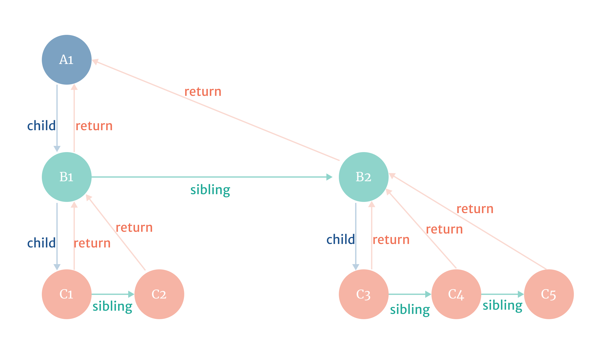
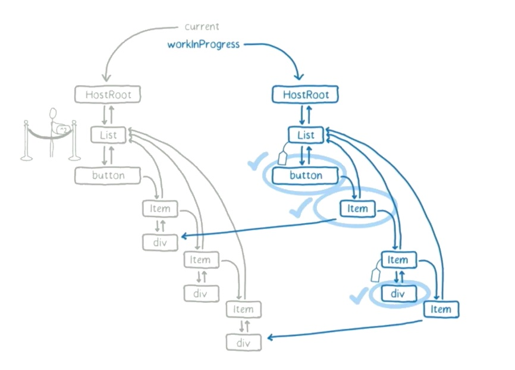
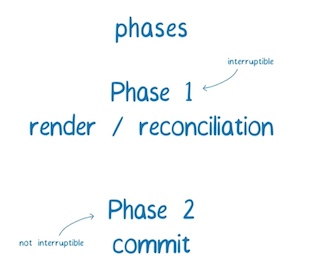
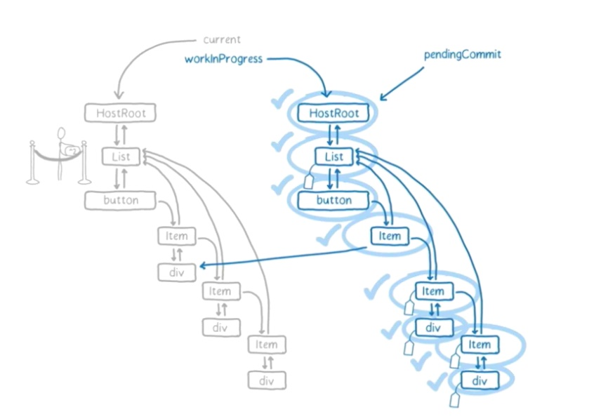
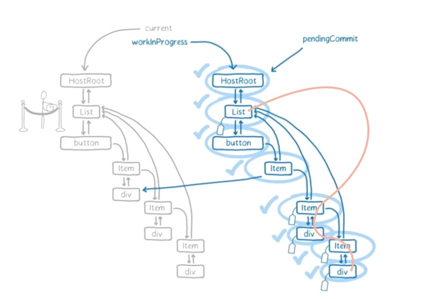
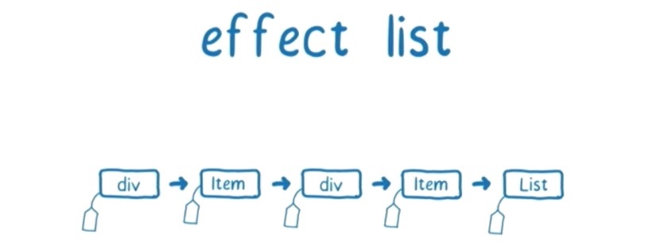

上一篇 [Why Fiber](https://perowong.space/fiber/why-fiber) 我们聊了 Fiber 解决了什么问题，以及解题的基本思路。我们继续看看，Fiber 具体是如何设计的。  
我们先看 Lin Clark 在 React Conf 上介绍什么是 Fiber 时说的一段话：

“Fiber is a plain object, that has a one to one relationship, manage the work for an instance. So it keeps the track of which instance is for using property state node, it also keeps the track of its relationships to other fibers in the tree.”  
看到这，大概知道，Fiber 其实是一个数据结构，需要记录节点和节点之间的关系。

我们回到 React 设计的元概念上：

```
ui = f(data)
```

即：渲染一个 React App，其本质上就是在调用一个函数，只不过这个函数还会调用其里面的其他函数，形成调用栈。  
通过 [Why Fiber](https://perowong.space/fiber/why-fiber) 我们了解到，JS 引擎自身的函数调用栈，我们无法控制，只能一条路走到黑。  
Fiber 要实现的，还是围绕这个设计的元概念，但是需要能获取新能力：打断调用栈（call stack）及手动操纵栈帧（stack frame）  
进而能实现如下目标：

- pause work and come back to it later（暂停工作，并且能之后回到暂停的地方）
- assign priority to different types of work（安排不同类型工作的优先级）
- reuse previously completed work（之前已经处理完的工作单元，可以得到重用）
- abort work if it's no longer needed（如果后续的工作不再需要做，工作可以直接被终止）

这四个目标如何实现，我们要在下面 `Structure of Fiber` 和 `General algorithm` 两大模块中得出答案

### 1) Structure of Fiber

我们先看 Fiber 的最最基础的原子形态。Fiber 被定义为一个数据结构，一个包含 component、input、output 等信息的 JavaScript object  
一个 Fiber 单元，既和 stack frame 相对应，也和组件的实例相对应。其完整的数据结构在 [ReactFiber](https://github.com/facebook/react/blob/6e4f7c788603dac7fccd227a4852c110b072fe16/packages/react-reconciler/src/ReactFiber.js#L78)  
我们具体看其中几个关键的字段

```js
{
  type,
  key,
  child,
  sibling,
  return,
  pendingProps,
  memoizedProps,
  pendingWorkPriority,
  alternate,
  ...
}
```

##### `type` and `key`

type 跟 React Element 的 type 是相对应的，对于 composite component 来说，其类型为 function component 或者 class component  
对于 host components (div, span, etc.)，其类型就是对应名的字符串  
key 是给 reconciler 在协调过程中，决定该 fiber 是否要复用

##### `child`, `sibling` and `return`

这 3 个字段会指向其他 fiber，描述了组件递归树 fiber 之间的关系  
child 对应的是组件 render 函数 return 返回的值，看这个例子

```js
function Parent() {
  return <Child />
}
```

Parent 的 child，指向 Child 组件  
当组件 render 函数返回多个值的时候，这时候就需要 sibling 来描述 fiber 之间的关系，比如

```js
function Parent() {
  return [<Child1 />, <Child2 />]
}
```

对于 Parent 来说，其 child 指向 Child1 组件  
然后 Child1 的 sibling，指向 Child2 组件

在实际递归过程中，子节点运算完后，应该回到父节点。在 fiber 设计中，节点有一个 return 属性，指向父节点  
如果一个 fiber 节点，有多个子节点，那么其下面的所有子节点都会指向该 fiber 节点，比如对于上面这个例子来说，Child1 和 Child2 的 return 都指向 Parent

这样，所有 fiber 之间的关系，就可以通过 child, sibling, return 给描述出来了，构成一个 fiber node 的 linked list

我们再来看一个例子，有如下组件：

```js
function B1() {
  return [<C1 />, <C2 />]
}

function B2() {
  return [<B3 />, <C4 />, <C5 />]
}

function A1() {
  return [<B1 />, <B2 />]
}
```

其对应的 fiber 结构是这样的（具体如何递归遍历，后续分析）


##### `pendingProps` and `memoizedProps`

从 React 组件的定义上讲，props 都是函数的参数。对于 pendingProps，是在函数执行之前，即将要改变的 props  
而 memoizedProps 为上次执行后的 props  
特别的，如果 pendingProps 等于 memoizedProps，那么表明该 fiber 上一次的 output 输出可以被复用，而不用再次计算，从而阻止了不必要的运算工作

##### `pendingWorkPriority`

用于标记 React fiber 当前任务优先级，源码中其定义为 ReactPriorityLevel。除 NoPriority 为 0 外，数字越大表示优先级越低

```js
const ReactPriorityLevels = {
  ImmediatePriority: 1,
  UserBlockingPriority: 2,
  NormalPriority: 3,
  LowPriority: 4,
  IdlePriority: 5,
  NoPriority: 0,
}
```

##### `alternate`

了解这个字段，我们需要了解 fiber 架构下的 react tree 有两棵（该版本的架构下不再提 Virtual DOM 的概念了），一棵是 current tree，另一棵是 workInProcess tree。所有的 work 都是在 workInProcess tree 的 fiber 上进行，而屏幕上呈现的是 current tree。当 react 遍历 current tree 的时候，会对 render 方法返回的 React Element 创建一个 alternate（备用）fiber，这些 fiber 节点构成了 workInProcess tree。当 react 处理完所有 work 后，会 flush workInProcess tree 到屏幕上，进而变为 current tree  
对于每个 fiber 节点的 alternate 字段来说，其用处就是保持对另一棵树对应节点的引用，current tree 上 fiber 节点的 alternate 指向 workInProcess tree 的 fiber 节点，反之亦然


### 2) General algorithm

了解了 Fiber 的原子结构后，我们来看 Fiber 是怎么工作的。React 把整个渲染任务工作分为两个阶段：phase 1 `render/reconciliation` 和 phases 2 `commit`


其中 render 阶段是可以中断的，commit 阶段是不能中断的。我们先看为什么 render 阶段可以被中断？再看两个阶段的具体分别实现

#### 2.1）为什么 render 阶段可以被中断？

在上面解析 Fiber 数据结构的 alternate 字段时候，提到了 workInProcess tree 和 current tree，其中展示在屏幕上的是 current tree，而所有的 work 都在 workInProcess tree 上进行。也就是说，只要 workInProcess tree 不更新到屏幕上，用户对树的改变是不可见的，所以在 render 阶段，如果中断了任务，也不会导致对用户有可见的更改。  
另一个重要点是，render 阶段的执行是设计为**异步执行**的，在 [Why Fiber #2 对应的解决方案](https://perowong.space/fiber/why-fiber/#2对应的解决方案) 分析过，React 根据可用时间来处理 fiber 节点，以及根据时间决定是否要暂停工作，让出主线程控制权给浏览器处理其他事件，等处理完之后，再从停止的地方继续（有的时候也会丢弃完成的工作从头再来，比如又更高优先级的任务插入）。  
BTW，在 commit 阶段不能中断，是因为执行是同步的，在此阶段执行的工作，会生成用户可见的变化（比如 DOM 更新），React 需要一次完成。

#### 2.2) Render phase

在 render 阶段，React 在应用层通过 setState 或者 React.render，来确定需要更新到 UI 上的内容，其符合 `ui=f(data)` 的设计元概念。如果是第一次渲染，React 会更具 render 函数，返回每一个 React Element，创建对应新的 fiber 节点，这些节点在接下来的更新中将根据首次创建的 fiber 节点，进行复用或者更新

render 阶段执行后的结果是什么？  
生成一棵 finishedWork tree，这棵树上的一部分 fiber 节点被标记上了 side-effects（副作用）。然后基于这棵树，将标记了 side-effects 的 fiber 节点构建出一个 Effect List 的线性链表，可以给到 commit phase  

如上图所示，current tree 上所有 work unit 执行完毕，其中有一些节点打上了 tag，整棵树处于 pendingCommit 状态

##### Side-effects

React 官方文档中这么描述 side-effects

> You’ve likely performed data fetching, subscriptions, or manually **changing the DOM** from React components before. We call these operations “side effects” (or “effects” for short) because they can affect other components and can’t be done during rendering.

还是 `ui=f(data)` 的设计概念，React 将组件设计为一个通过 state 或者 props 来计算更新 UI 的函数，相对应的，每一次 DOM 更新或者调用生命周期方法就被视为 side-effects。  
在 fiber 架构中，fiber node 给 side-effects 提供了一个方便的追踪机制，每个 fiber node 都可以有与之相关的 effects，在 fiber 的数据结构中用 effectTag 表示。其值大致如下：

```js
export const Placement = /*          */ 0b00000000000000000000000010;
export const Update = /*             */ 0b00000000000000000000000100;
export const PlacementAndUpdate = /* */ Placement | Update;
export const Deletion = /*           */ 0b00000000000000000000001000;
...
export const Snapshot = /*           */ 0b00000000000000010000000000;
...
```

> 这里设计为二进制数据结构，是为了方便为一个 fiber 标记多个 effectTag，比如里面的 PlacementAndUpdate，直接对 Placement 和 Update 做“异或”操作即可得标记出多个 tag。而当后续 commit 阶段判断需要做哪些操作时，只需要将 fiber 上的 effectTag 与之做“与”操作即可

在 render 阶段时调用的生命周期列表如下：

- [UNSAFE_]componentWillMount (已废弃)
- [UNSAFE_]componentWillReceiveProps (已废弃)
- getDerivedStateFromProps
- shouldComponentUpdate
- [UNSAFE_]componentWillUpdate (已废弃)
- render

这里顺带讲一下，componentWillMount、componentWillReceiveProps、componentWillUpdate 为什么要废弃？首先，上面提到 render 阶段是异步执行，可被中断的，再次回来的时候有可能会丢弃已经完成的工作从头再来，这样就会导致有的 fiber 节点在 render 阶段，会重复调用 componentWillMount 这个生命周期，导致不符合开发者的预期。其次，开发者有可能会在这些生命周期函数里，将带有 side-effects 的代码放在里面，导致异步更新出现问题。

##### Effect List

前序提到，render 阶段执行完之后，会得到一棵 finishedWork tree，但如果将整棵树拿去做 commit 更新，其实有可以让时间效率更高，性能更优的方案。其中之一，就是 React 将带有 side-effects 的 fiber 节点，构建出一个独立的线性链表。其思路就是，迭代线性链表比迭代树快的多，且没有必要在没有 side-effects 的节点上浪费其他时间。  
React 用 firstEffect 表示链表开始的位置，用 nextEffect 表示下一个链表节点。

> [Dan Abramov](https://twitter.com/dan_abramov): I'd like to think of it as a Christmas tree, with “Christmas lights” binding all effectful nodes together.  
> Dan Abramove 为 effecs list 提供了一个类比: 他喜欢将它想象成一棵圣诞树，“圣诞灯”将所有带有 effects 的节点绑定在一起




---

render phase 再深入去分析，还有一些有趣的问题：

- work loop 工作和暂停代码上如何实现？
- workInprocess tree 如何遍历？
- 一个 work unit 具体有哪些工作要做？
- 如何 diff 得出 fiber 节点要增/改/删的标记？

这些我们留作后续再做分析

#### 2.3) Commit phase

从 render 阶段，我们知道其产出的结果有：

- finishedWork tree
- effects list

finishedWork tree 表示需要在屏幕上反映的状态  
effects list（通过 nextEffect 指针链接的，finishedWork 树中节点的子集），是一个被标记过 side-effects 的链表，每个节点携带了需要插入，还是更新，或删除，以及调用其生命周期方法的信息

所以 commit 阶段相对来说就比较清晰，状态及要做的工作都已经确定，根据 [commitRoot](https://github.com/facebook/react/blob/95a313ec0b957f71798a69d8e83408f40e76765b/packages/react-reconciler/src/ReactFiberScheduler.js#L523)，我们了解到，它会执行以下操作:

- 在标记了 Snapshot effect 的节点上使用 getSnapshotBeforeUpdate 生命周期方法
- 在标记了 Deletion effect 的节点上调用 componentWillUnmount 生命周期方法
- 执行所有 DOM 插入，更新和删除
- 将 finishedWork 树设置为 current 树
- 在标记了 Placement effect 的节点上调用 componentDidMount 生命周期方法
- 在标记了 Update effect 的节点上调用 componentDidUpdate 生命周期方法

在调用 pre-mutation 方法 getSnapshotBeforeUpdate 之后，React 会在树中提交所有 side-effects。分为两个部分：

1. 第一部分，执行所有 DOM（Host Component）插入，更新，删除和（Class Component）ref 卸载。然后，React 将 finishedWork 树分配给 FiberRoot，正式将 current 树替换为 workInProgress 树。在替换进入第二部分之前，React 会执行 componentWillUnmount。
2. 第二部分中，React 调用所有其他生命周期方法（和 ref callback）, 这些方法将会单独执行，因为已经完成了整个树中的所有放置(placement)，更新和删除，所以在 componentDidMount，componentDidUpdate 是在最新的树中完成执行。

以上我们基本分析完 Fiber 是怎么设计的，如果有后续进一步的分析，我会超链到这里。
