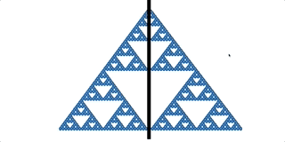
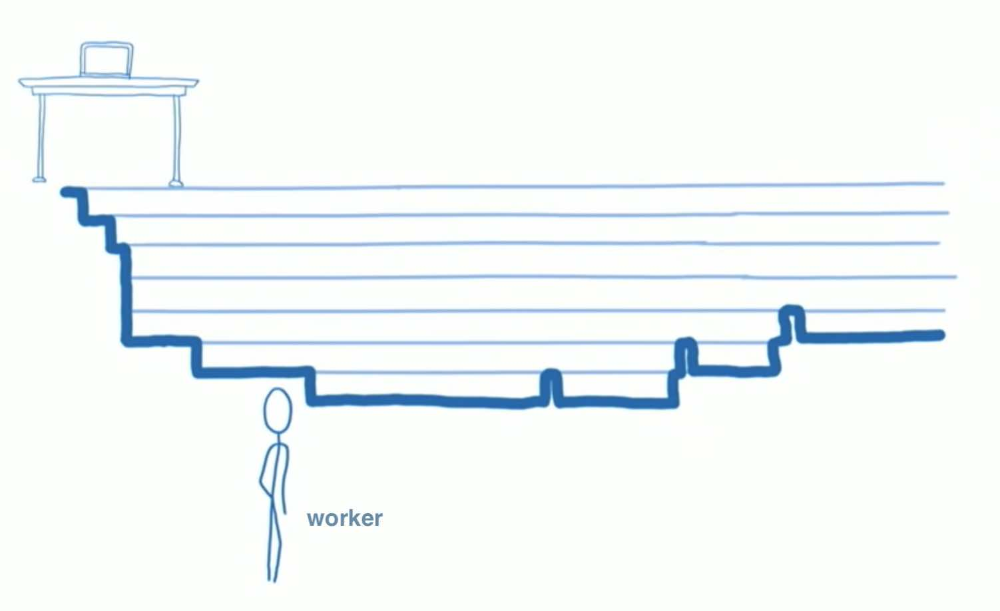
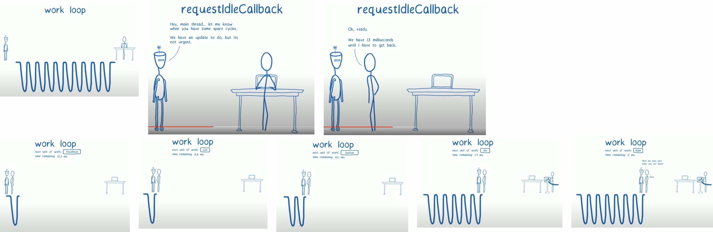

React 发布 v16 时，对其核心算法 reconciliation 进行了重构，并命名为之 React Fiber。为什么 react 团队要对架构进行重构，Fiber 架构解决了什么？我们从 v15 存在的瓶颈说起

### 1）Fiber 要解决的问题

我们先来看一段 Cartoon

这是 React Conf 上 [Lin Clark](https://www.youtube.com/watch?v=ZCuYPiUIONs&list=PLb0IAmt7-GS3fZ46IGFirdqKTIxlws7e0&index=6) 介绍 Fiber 时开场引入的一段动画。动画左半部分展示了 v15 版本下应对大量渲染工作时（Stack Example），出现掉帧卡顿的现象。而同样 DOM 结构下的 Fiber 架构版本（右半部分）则显现出平滑的渲染效果（Fiber Example）。

到这，我们大概知道了，Fiber 架构主要是为了解决处理非常庞大的渲染工作时，UI 上能感知到的掉帧卡顿现象，而出现。

#### 1.1）这个问题是怎么引起的

为什么会有这个问题？我们先简单看下 v15 架构，分为三层：

- Virtual DOM —— 描述页面长什么样
- Reconciler（协调器）—— 负责进行 Diff 运算，调用组件生命周期方法等
- Rerender（渲染器）——负责将变化的组件渲染到页面上，按平台分主要分为 ReactDOM、ReactNative

其中，在 React v15 中，reconciler 是 Stack Reconciler，stack reconciler 是不能中途打断，需要跟递归的堆栈挨个执行完，直至栈空。这样的话，在组件树像上面 Cartoon 演示那样，庞大到一定程度，且在不断更新组件状态的时候，就有可能出现掉帧的现象。

我们来看这两个`关键点`：

- stack reconciler 不能中途被打断
- 浏览器为什么会出现掉帧

##### 1.1.1）stack reconciler 不能中途被打断

大家知道，React render 函数是从 App Root 根节点以树状结构逐层展开的，其构建出来的是一颗 Virtual DOM 树。当要更新状态重绘组件时，React v15 的 reconciler 会同时遍历两个字元素列表 Virtual DOM，Diff 差异，当产生差异时，生成一个 mutation，更新渲染组件。这里的遍历使用的是树常用的递归遍历，只要有子节点，会一直保持迭代，直至处理完所有节点，堆栈为空，退出迭代（故 React 团队也称这个 reconsiler 为 stack reconciler）。其中，整个过程的 JS 计算，会一直占据浏览器主线程。

##### 1.1.2）浏览器为什么会出现掉帧

上面提到 DOM 树庞大到一定程度更新时会出现掉帧，那一定程度是多少程度？一般来说，按浏览器每秒刷新 60 次来算（即所谓的 60 FPS），当页面需要连续渲染，却在下一个 16ms 内没有渲染的情况下，就会出现掉帧的现象。也就是说，如果浏览器假如有计算执行任务阻塞了浏览器渲染，且阻塞时间超过 16ms ，就会出现卡顿掉帧被人眼所感知到。

我们都知道，JS 是单线程的，在默认情况下，JS 运算、页面绘制渲染都是运行在浏览器的主线程当中，它们之间是互斥的关系，即任何时候只能有一个占用主线程。如果 JS 运算长时间持续占用主线程，页面就没法得到及时的更新。如 **1.1.1）stack reconciler 不能中途被打断** 所示，只要 stack reconciler 持续使用主线程的时间，超过 16ms，页面绘制渲染就没法获得控制权，就容易出现渲染掉帧的现象。

### 2）对应的解决方案

上面提到的两个关键点，也是解题的题眼：

- reconciler 在协调的时候能否被打断暂停
- 进行 DOM diff 时，如何在 16ms 时间窗内不阻塞浏览器渲染

Lin Clark 给我们展示了另一段动画

> 由于视频太长，我们示意其中几个关键图

React 团队引入了一个角色：**Scheduler**

### 3）What's Fiber

"Fiber is a plain object, that has a one to one relationship, manage the work for an instance. So it keeps the track of which instance is for using property state node, it also keeps the track of its relationships to other fibers in the tree."

Fiber 是一种数据结构，是一个链表结构，用于跟踪

#### 3.1）Fiber 是怎么设计的

#### 3.2）Fiber 为什么要设计成链表树
