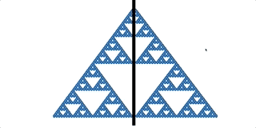
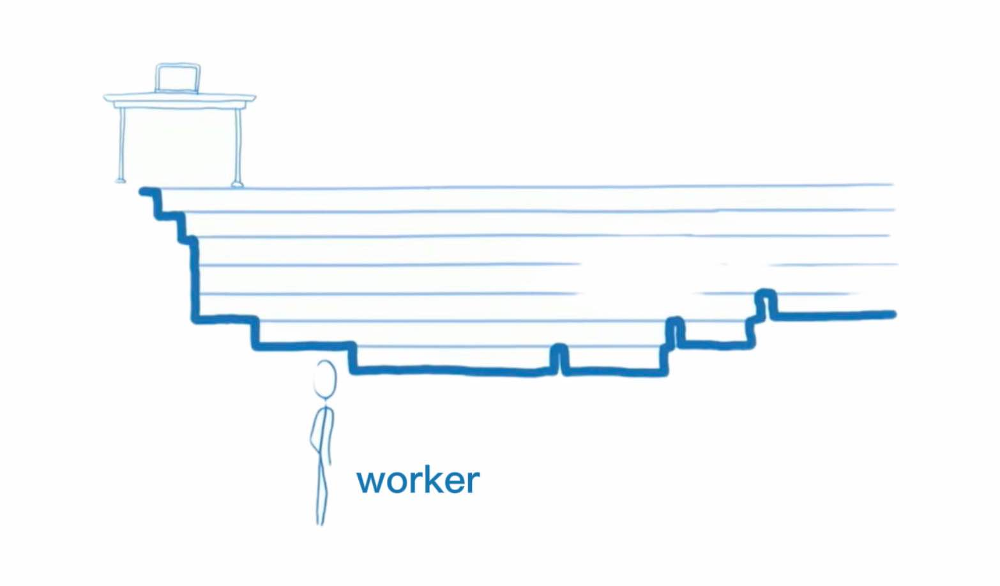
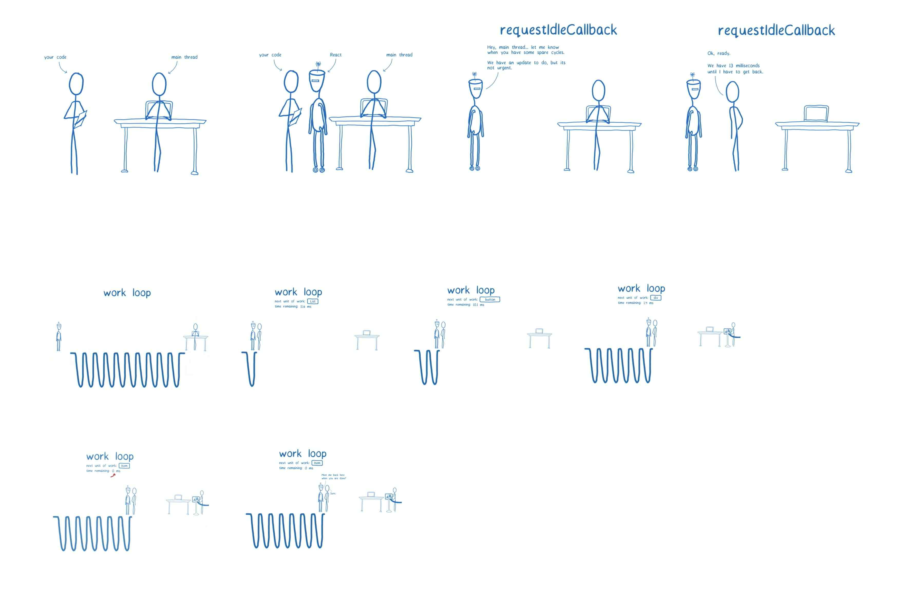

React 发布 v16 时，对其核心算法 reconciliation 进行了重构，并命名为之 React Fiber。  
为什么 react 团队要对架构进行重构，Fiber 架构解决了什么？我们从 v15 存在的瓶颈说起

### 1）Fiber 要解决的问题

我们先来看一段 Cartoon  
  
这是在 [React Conf](https://www.youtube.com/watch?v=ZCuYPiUIONs&list=PLb0IAmt7-GS3fZ46IGFirdqKTIxlws7e0) 上 [Lin Clark](https://www.youtube.com/watch?v=ZCuYPiUIONs&list=PLb0IAmt7-GS3fZ46IGFirdqKTIxlws7e0&index=6) 介绍 Fiber 时，开场引入的一段动画。动画左半部分展示了 v15 版本下应对大量渲染工作时（Stack Example），出现掉帧卡顿的现象。而同样 DOM 结构下的 Fiber 架构版本（右半部分）则显现出平滑的渲染效果（Fiber Example）。

到这，我们大概知道了，Fiber 架构主要是为了解决处理非常庞大的渲染工作时，UI 上能感知到的掉帧卡顿现象，而出现。

#### 1.1）这个问题是怎么引起的

为什么会有这个问题？我们先简单看下 v15 架构，分为两层：

- Reconciler（协调器）—— 负责进行 Diff 运算，调用组件生命周期方法等
- Renderer（渲染器）——负责将变化的组件渲染到页面上（分平台主要有 ReactDOM、ReactNative）

每当有更新发生时，Reconciler 会做如下工作：

- 调用函数组件的 render 方法，将返回的 JSX 转化为 Virtual DOM
- 将 Virtual DOM 和上次更新时的 Virtual DOM 进行对比
- 通过 Diff 找出差异
- 通知 Renderer，将变化的 Virtual DOM 渲染到页面上

其中，在 React v15 中，reconciler 是不能中途被打断的（Stack Reconciler），需要将递归调用的堆栈挨个执行完，直至栈空。这样的话，当组件树像上面 Cartoon 演示那样，层级很深、庞大到一定程度，且在不断更新组件状态的时候，就有可能出现掉帧的现象。

我们来看这两个`关键点`：

- stack reconciler 不能中途被打断
- 浏览器为什么会出现掉帧

##### 1.1.1）stack reconciler 不能中途被打断

由上，我们知道，React 在组件的 render 函数里通过 JSX 描述 DOM 树，是从 App Root 根节点以树状结构逐层展开的，其构建出来的是一棵 Virtual DOM 树。当要更新状态重绘组件时，React v15 的 reconciler 会同时遍历两个新旧子元素列表 Virtual DOM，Diff 差异，当产生差异时，生成一个 mutation，通知 Renderer 更新渲染组件。  
其中，v15 使用的是 JS 引擎自身的函数调用栈，只要有子节点，会一直保持迭代，直至处理完所有节点，堆栈为空，才退出堆栈（React 团队也称这个 reconsiler 为 stack reconciler）。其中，整个过程的 JS 计算，会一直占据浏览器主线程。  

##### 1.1.2）浏览器为什么会出现掉帧

上面提到 DOM 树庞大到一定程度更新时会出现掉帧，那一定程度是多少程度？一般来说，按浏览器每秒刷新 60 次来算（即所谓的 60 FPS），当页面需要连续渲染，却在下一个 16ms 内没有渲染的情况下，就会出现掉帧的现象。也就是说，如果浏览器假如有计算执行任务阻塞了浏览器渲染，且阻塞时间超过 16ms ，就会出现卡顿掉帧被人眼所感知到。

我们都知道，JS 是单线程的，在默认情况下，JS 运算、页面绘制渲染都是运行在浏览器的主线程当中，它们之间是互斥的关系，即任何时候只能有一个占用主线程。如果 JS 运算长时间持续占用主线程，页面就没法得到及时的更新。如 **1.1.1）stack reconciler 不能中途被打断** 所示，只要 stack reconciler 持续使用主线程的时间，超过 16ms，页面绘制渲染就没法获得控制权，就容易出现渲染掉帧的现象。

### 2）对应的解决方案

上面提到的两个关键点，也是解题的题眼：

- reconciler 在协调的时候能否被打断暂停
- 进行 DOM diff 时，如何在 16ms 时间窗内不阻塞浏览器渲染

Lin Clark 给我们展示了另一段动画  

> 视频太长，我们示意其中几个关键图  
> 几句关键对话：  
> “**React**: Hey, main thread... let me know when you have some spare scycles. We hanve an update to do, but its not urgent.  
> **Main thread**: Ok, ready, we have 13 millseconds until I have to get back.  
> ... when time is run out  
> **React**: Meet me back here when you are done?  
> **Main thread**: Sure.”

从图中我们可以看出来，v16 的 React 在代码和 main thread（主线程）之间的角色协调控制能力更强，在有更新任务的时候，会去“询问”获取得到 main thread 的空闲时间周期，在一个 work loop（工作循环）内，逐个处理 work unit，并且判断剩余时间是否充足（此外，还会判断是否有高优先级的任务，截图里未示意），进而决定继续处理、挂起、或者完成工作循环。
图中示意的是，React 获取到了主线程 13ms 的空闲时间，一起进入到一个工作循环中，完成了 List、button、div、Item 这几个 work unit，但是当完成 Item 这个 work unit 之后，时间用尽，React 按下了“暂停”，归还主线程 worker 控制权给浏览器，并告诉其完成其他工作之后回来到“老地方”接着继续。

以上，两个卡顿的核心问题有了解法：将运算进行切割，切分为多个 work unit（工作单元），分批完成。  
在完成一个 work unit 之后，将主线程控制权交回给浏览器，如果浏览器有 UI 渲染工作要做的话，能让其在 16ms 的窗口期内，占用主线程有时间去做，而不像之前主线程被 stack 递归栈一直霸占而不得释放。在浏览器使用主线程完成渲染工作，有空闲时间后，再回到之前未完成的任务点继续完成剩余的 work unit。

事实上，Fiber 在设计出来后，就是需要能让 React 完成以下最主要目标：

- pause work and come back to it later（暂停工作，并且能之后回到暂停的地方）
- assign priority to different types of work（安排不同类型工作的优先级）
- reuse previously completed work（之前已经处理完的工作单元，可以得到重用）
- abort work if it's no longer needed（如果后续的工作不再需要做，工作可以直接被终止）

到这，Fiber 要解决的元问题，以及解决的基本思路出发点就清晰了，下一篇 **What's Fiber** 来看看 Fiber 具体是如何设计的。
