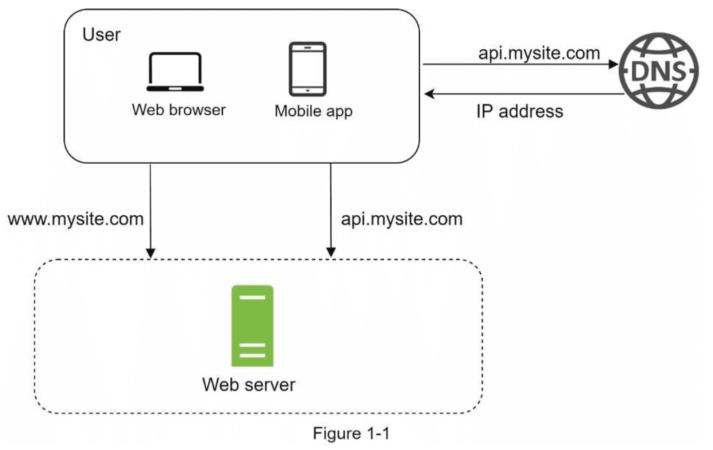

> This is one chapter of Amazon's system design handbook, it's very useful and friendly for freshman;)

Designing a system that supports millions of users is challenging, and it is a journey that requires continuous refinement and endless improvement. Here, we build a system that supports a single user and gradually scale it up to serve millions of users.

## Single server setup

A journey of a thousand miles begins with a single step, and building a complex system is no different. To start with something simple, everything is running on a single server. Figure 1-1 shows the illustration of a single server setup where everything is running on one server: web app, database, cache, etc.



To understand this setup, it is helpful to investigate the request flow and traffic source. Let us first look at the request flow (Figure 1-2).


1. Users access websites through domain names, such as api.mysite.com. Usually, the Domain Name System (DNS) is a paid service provided by 3rd parties and not hosted by our servers.
2. Internet Protocol (IP) address is returned to the browser or mobile app. In the example, IP address 15.125.23.214 is returned.
3. Once the IP address is obtained, Hypertext Transfer Protocol (HTTP) requests are sent directly to your web server.
4. The web server returns HTML pages or JSON response for rendering.

Next, let us examine the traffic source. The traffic to your web server comes from two sources: web application and mobile application.

- Web application: it uses a combination of server-side languages (Java, Python, etc.) to handle business logic, storage, etc., and client-side languages (HTML and JavaScript) for presentation.
- Mobile application: HTTP protocol is the communication protocol between the mobile app and the web server. JavaScript Object Notation (JSON) is commonly used API response format to transfer data due to its simplicity. An example of the API response in JSON format is shown below:

```json
{
  "id": 12,
  "firstName": "John",
  "lastName": "Smith",
  "address": {
    "streetAddress": "21 2nd Street",
    "city": "New York",
    "State": "NY",
    "postalCode": 10021
  },
  "phoneNumbers": [
    "212 555-1234",
    "646 555-4567"
  ]
}
```

## Database

With the growth of the user base, one server is not enough, and we need multiple servers: one for web/mobile traffic, the other for the database (Figure 1-3). Separating web/mobile traffic(web tier) and database(data tier) servers allows them to be scaled independently.


### Which database to use?

You can choose between a traditional relational database and non-relational database. Let use examine their difference.

Relational database are also called a relational database management system(RDBMS) or SQL database. The most popular ones are MySQL, Oracle database, PostgreSQL, etc. Relational databases represent and store data in tables and rows. You can perform join operations use SQL across different database tables.

Non-Relational database are also called NoSQL databases. Popular ones are CounchDB, Neo4j, Cassandra, HBase, Amazon DynamoDB, etc. These databases are grouped into four categories: key-value stores, graph stores, column stores, and document stores. Join operations are generally not supported in non-relational databases.

For most developers. relational databases are the best option because they have been around for over 40 years and historically, they have worked well. However, if relational databases are not suitable for your specific use cases, it is critical to explore beyond relational databases. Non-relational databases might be the right choice if:

- Your application requires super-low latency.
- Your data are unstructured, or you do not have any relational data.
- You only need to serialize and deserialize data(JSON, XML, YMAL, etc.).
- You need to store a massive amount of data.

## Vertical scaling vs horizontal scaling

Vertical scaling, referred to as "scale up", means the process of adding more power (CPU, RAM, etc.) to your servers. Horizonal scaling, referred to as "scale-out", allows you to scale by adding more servers into your pool of resources.

When traffic is low, vertical scaling is a great option, and the simplicity of vertical scaling is its main advantage. Unfortunately, it comes with serious limitations.

- Vertical scaling has a hard limit. It is impossible to add unlimited CPU and memory to a single server.
- Vertical scaling does not have failover and redundancy. If more server goes down, the website/app goes down with it completely.

Horizonal scaling is more desirable for large scale applications due to the limitations of vertical scaling.

In the previous design, users are connected to the web server directly. Users will unable to access the website if the web server is offline. In another scenario, if many users access the web server simultaneously and it reaches the web server's load limit, users generally experience slower response or fail to connect to the server. A load balancer is the best technique to address the problems.

## Load balancer

A load balancer evenly distributes incoming traffic among web servers that are defined in a load-balanced set. Figure 1-4 shows how a load balancer works.


As shown in Figure 1-4, users connect to the public IP of the load balancer directly. With this setup, web servers are unreachable directly by clients anymore. For better security, private IPs are used for communication between servers. A private IP is an IP address reachable only between servers in the same network; however, it is unreachable over the internet. The load balancer communicates with web servers through private IPs.

Unfinished to be written...
