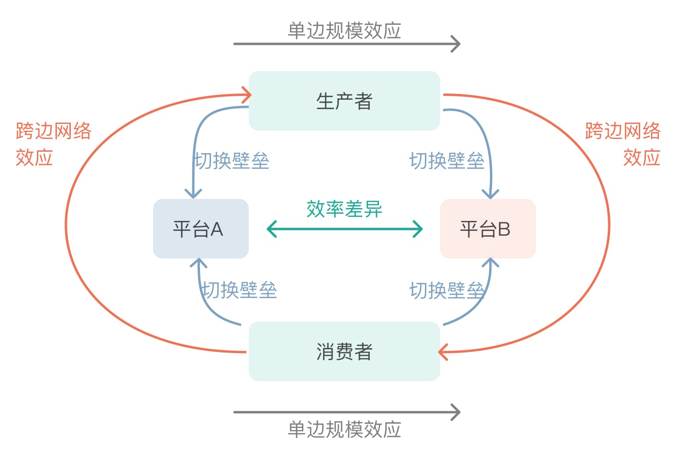

我们在研究产品、策划产品的时候，一般会使用一些通用模型来辅助思考当前正在进行中或者探索中的业务形态、商业模式，其静态终局格局，或者动态演进过程。当前互联网平台中，双边市场效应是最常见的一个业务模型体现。双边市场比其他大多数行业具备更强的规模效应，更容易形成寡头、赢者通吃、甚至垄断的市场格局。

## 1) 什么是双边市场？

我们先来看什么是双边市场。一个双边市场通常包含两个主要方面：

1. 市场中有两个不同类型的用户，他们通过一个中介结构/平台来发生作用或者进行交易
2. 一边用户的决策会影响另外一边的结果

在通常的业务模型中，我们习惯用生产者和消费者来指代双边的用户，一边做内容`供给`，一边对内容进行对应`需求`消费。当然，这个习惯也有例外，比如 dating 相关的应用，男性用户和女性用户也可以构成一个双边关系，虽然无法明确谁属于哪一端，但却符合上述两个主要方面条件。

|          | 生产者     | 消费者 |
| :------- | :--------- | :----- |
| 内容社区 | 内容创作者 | 读者   |
| 外卖     | 商家、骑手 | 买家   |
| 打车     | 司机       | 乘客   |
| 购物平台 | 商家       | 买家   |

在双边市场里，会出现`跨边网络效应`，即某一边的数量提升，可以提升另一边的效用/收益。在大多数生产消费组成的双边市场业务模型中，生产者（品类/数量）的增加可以提高消费者的选择丰富度，从而提高消费者的效用；消费者的增加可以增加生产者的销量，提升生产的收益（比如在单位生产成本随数量递减的情况下，需方消费越多，收益越大）。

通常情况下，规模效应在供给端更容易产生（在一定条件下，产量越高，总成本越低，其本质在于规模对于固定成本的摊薄），但在双边市场的效应下，规模效应会同时作用于供给消费双端，不仅生产端的固定成本得到摊薄，且需求消费端的需求也在提升。对应的，需求端消费提升，会促进生产端需求产量进一步提升，进入正循环。故双边市场的规模效应会更为强大，更容易高度集中。

在强规模效应下，平台之间的竞争常常出现垄断的竞争格局，但在现实中，很少有平台能做到完全的一家独大。其中让格局集中、分散的因素是什么？

## 2) 双边市场下，决定行业集中度的四要素

通常，可以用下图模型来大致描述两个平台之间的竞争格局，且暂且归纳为如下四个主要因素决定竞争格局（“+”表示促进格局集中，“-”表示让格局分散）

- `跨边网络效应`（+）：如上所述，一端的数量提升，促进另一端的效用/收益，该效应越强，规模效应越大，越容易促进竞争格局的集中
- `效率差异`（-）：平台产品之间通常会做差异化定位，以避开竞争而求得生存，从而使平台之间呈现分散的竞争格局。对于传统平台而言，可以是效率的差异化，也可以是细分市场的差异战略。但互联网行业，一般是效率的差异可以求得共存。效率差异越大，越促进分散。
- `切换壁垒`（+）：切换壁垒的高低，体现在用户的单归/多归属性上。用户有意愿同时使用多个平台，用户体现出多归属性。相应的，如果切换壁垒越高，用户体现出强单归属性，促进竞争格局集中。
- `单边规模效应`（+）：某一边参与方自身的规模效应（常见于供给端，当然某一端也有可能出现自己的双边市场效应或网络效应）。该规模效应越大，越促进竞争格局的集中

### 2.1) 跨边网络效应的强弱

该效应强，比较好理解，一边对另一边有明显的促进作用，先发优势比较明显，越早进入市场的平台，越有机会成为寡头。  
但如果该效应弱，先发优势并不明显，拼到后期，往往渠道、流量成为核心竞争力。

比如有些行业，消费者对多样性的需求不高，跨边网络效应就会衰减得快。其中一个案例，直播行业中的秀场直播，其模型确实非常接近双边市场模型，但因为跨边网络效应微弱，其内容极为同质化，主播的数量增加，无法为用户带来更多样化的体验，对应平台的多样化价值就会有限，“主播数量更多”无法形成核心竞争力。在秀场直播中，各主播主要是一边和用户聊天，一边做些才艺表演，相互之间差异化弱，造成了用户的使用逻辑大致分两类：1. 认定某几个比较熟悉的主播，尤其是打过赏的主播；2. 渠道推什么主播，就看什么主播，不进行筛选。从实际表现来看，到目前，抖快在秀场类直播的行业头部占据了前二，但回溯其发展历程，抖快都是后起之秀，且是坐拥大量用户的短视频巨头。往前看，在PC端的YY，移动端的映客先声夺人之后，市场份额很快就被坐拥大量用户的后来者居上，秀场类直播的内容和变现同质化，用户获取能力成了平台的核心竞争力，随着各平台争相买量，获客成本越来越高，到后期没有自由流量的平台，用户增长停滞。

### 2.2) 效率差异

效率的差异化是同一行业内，平台之间可以共存的核心原因。平台效率一般分为：供应链效率、信息匹配效率、履约效率，基本对应了商品或者服务从生产到交付的三大阶段。

- `供应链效率`：商品/服务被生产出来的效率，其主要指标是生产成本
- `信息效率`：供方的商品/服务和需方消费者之间的匹配效率，其主要指标是匹配准确度
- `履约效率`：将商品/服务交付给消费者的效率，其主要指标是履约成本

互联网平台的本质就是信息交互的革命，信息效率往往是互联网模式异军突起的核心竞争力。比如电商平台出现之前，靠人去线下卖场或者问人寻找匹配商品，到电商平台出现，通过搜索降低检索匹配成本，到电商根据算法推荐商品，包括近两年直播带货，通过选品靠“货找人”，都是在一次次变革或者升级信息匹配效率。

提到电商平台，这里面有个很有意思的案例，在阿里、京东占据了绝对市场份额之后，为何拼多多还能崛起？

#### 2.2.1) PDD的异军突起

PDD能起来，其中有四个必要条件：
1. 用户端：2017年，微信小程序的推出，不需要为一个购物体验下载新App，就能为微信用户提供了类似App的基础体验
2. 商户端：2015到2018年，ali系为了获取更高的广告收入，刻意将流量从淘宝转向天猫，2016年，ali通过打假，全年下架24万家店铺，为PDD早期的商户供给提供了基础
3. 支付端：从2014年微信通过红包切入支付市场，到2017年，微信支付已经将微信用户在微信内的支付习惯培养起来
4. 物流端：各种第三方物流成熟，且单票成本下降。比如韵达单票已由2013年的3.6元左右，到2018年上半年已经下降到1.7元左右

但这四个只是必要条件而已，并非充分条件

其核心点在于，PDD采用了相比较于ali**独特的商品分发策略**。早期的PDD，除了弱化搜索匹配，不强调店铺概念，避开和阿里正面的店铺品牌竞争，而是拼成功才下单之外，商品和用户的匹配主要靠社交传播（微信内的裂变传播）和信息推荐（小程序内的商品流），且采取了和ali完全不同的商品匹配分发策略。

- PDD：`以成交量为核心的商品分发策略`
  - 以算法推荐为核心，将成交量最大的商品推荐给最多的用户，加之在微信内的拼单及各种社交裂变传播，头部商品的成交量非常大
- ali：`以成交利润为核心的商品分发策略`
  - ali内商品获得流量主要依靠买量，大部分流量都要商家花钱，最后往往是利润高的商品获得高流量。比如高毛利的美妆品牌、女装品牌占据大部分推荐流量，在搜索里也往往是品牌最强、利润最高的单品占据头部位置（前面也提到2016年起ali打假，塑造品牌刻意而为之，这一策略即体现在推荐分发内）

而这两个核心的差异策略，PDD在白牌商品上体现最为明显（换言之，早期PDD的逻辑对白牌之外的商品大都不适用）。白牌商品是定义为没有（或很少）产生品牌的商品，如垃圾袋、拖鞋等。对于白牌标品，消费者的决策主要因子就是商品的价格优势，不用浪费时间成本做过多比较，且PDD结合了微信社交拼单的逻辑，朋友拼单的商品，社交关系给白牌商品进一步降低决策成本。

对应的，PDD在商品信息流`信息效率`分发匹配的核心逻辑是：

是把别人买的也推荐给你，而对于白牌标品，消费者的决策逻辑是非常相似的(最核心因子是价格是否低)，这样准确匹配的概率就非常高。  
而ali的逻辑则不然，在ali系，大部分流量都是要花钱的，但对于白牌商品， 竞争激烈，毛利非常低，如果要花钱去推广，往往意味着售价必须大幅提升，以覆盖成本。所以在这种情况下，ali系获取流量的往往是高品质、高售价的商品，并不能让消费者满意。比如当消费者要买垃圾袋的时候，PDD推荐的平价垃圾袋更能让主流消费者满意，而在ali系，获得流量的只有高单价高品质的 “优质垃圾袋”，这并不是主流消费者的诉求。  
而另一个竞争对手JD，因为高昂、刚性的自营物流支出，更不可能把流量分到低单价低毛利的白牌商品。  
在这样的情况下，早期PDD的流量分发机制，才能够为白牌商品做更准确的匹配。所以PDD以为核心竞争力，可以在ali、JD中间异军突起。

此外，在`供应链效率`上，PDD的爆款机制，也提升了供应链的规模效应：

PDD在流量分发上，更容易产生爆品，可以让上游工厂产生更 强的规模效应，压低成本。考虑到白牌商品的供给集中度非常低，但产能相对充裕，爆品能带来的规模效应收益非常大。
虽然同样是以广告进行变现，早期PDD和ali的逻辑并不一样，ali赚的是品牌溢价中的一部分，而早期PDD赚的是规模效应中的一部分。

留一个思考点：在线教育行业在市场内也是呈现分散的市场竞争格局，效率差异这一要素有对该分散格局有促进作用么？如果有，该要素下，是什么核心点促进了竞争格局的分散？

### 2.3) 切换壁垒

对于互联网平台产品，使用者切换壁垒主要体现在是否具有多归属属性。行业的多归属倾向越明显，行业的竞争格局越趋向于分散。

- 多归属:指生产者或消费者具有同时使用多平台的行为
- 单归属:指生产者或消费者只使用一个平台的行为

通常而言，消费者相对懒惰，不太倾向于使用多个平台，而生产者则非常勤奋，会多个平台综合比较。因为对于前者而言，平台效率的差距对生活影响并不大，而对于后者来说，往往则是事业的根本  
而同样对于消费端用户，娱乐属性强的平台更倾向于单归属，电商属性强的平台更倾向于多归属，其中单价越高的平台越倾向于多归属。譬如大部分用户可能只需要一个短视频类的APP，却需要多个电商APP，买垃圾袋的时候更可能在PDD看完就下单，但买高价位手 机的时候却会在JD、ali、PDD多家比价

拿打车行业来举例，**司机和乘客的多归属性相对压低了打车行业的壁垒**

- 司机端：除了平台专门雇的全职司机外（现实中占比很小），对于司机而言，当有新的打车软件出现的时候，一般会把各个打车App打开，以提高接单效率。如果所处地点、所处时段单量少，更会加剧这一现象，以减少自己的空车等待时间
- 乘客端：对于乘客，一般情况下，只要对于价格不太敏感，一般会只在一个平台打车。而对于价格敏感型用户，一般会多个App同时叫车（这里暂不考虑平台之间的安全性、舒适度差异）。特别是当遇到高峰期的时候，非价格敏感型用户也会倾向于希望多平台叫车，以提升匹配速度，因为这时候时间要素是第一位的

多开行为背后的本质原因是供需失衡，供需两边相对缺乏的一端更有可能多开，具体表现为供不应求，或者供过于求。而供需失衡的原因需要具体场景具体分析。

这里留两个思考点：
1. 就切换壁垒而言，为何外卖行业的壁垒相对高于打车行业？
2. 在线教育行业的市场分散格局，切换壁垒是一个关键促进要素么？为什么？

### 2.4) 单边规模效应

单边规模效应，是四要素的最后一个要素，指的是生产端或消费端单边的规模效应，如果在体量较小的时候就出现了规模不经济，则有可能导致行业走向分散。

互联网行业的规模不经济，主要表现为群体的互斥效应。由于互联网的无边际成本扩张的属性，无论在生产端还是消费端，我们观察到的规模效应通常都是正的。但是在某些特殊情况，我们还是会看到行业会出现单边的规模不经济，而这通常来自于群体出现互斥效应，即一拨人/物/内容不愿意和另一拨人/物/内容在一起，这就引导行业走向分散。

发展到今天，即使是群体互斥效应，在千人千面的技术下，也变得较为罕见了。在互联网的早期，会出现很多群体互斥带来的差异化空间，比如内容社区，随着流量的扩大，社区内容、质量走向通俗化，调性/个性越来越弱，社区早期活跃的较为硬核、重度的用户很容易出现流失。虽然现在这样的现象依然存在，但随着推荐算法千人千面技术的发展，用户之间的隔离越来越有效，群体互斥带来的市场机会越来越少。

---

以上，我们基本分析什么是双边市场效应，以及该模型下决定行业集中度的四要素。但双边平台的边界会在哪？平台和社会、竞争对手、上下游之间的关系是什么？以及当识别到一个具备双边市场效应的机会时，如何进行从0到1的业务策划？这些话题都值得再单独拿出来分析。  
另外，行业中其实会有很多有意思的案例可以拿来做分析，后续再整理后，会超链到这里。
